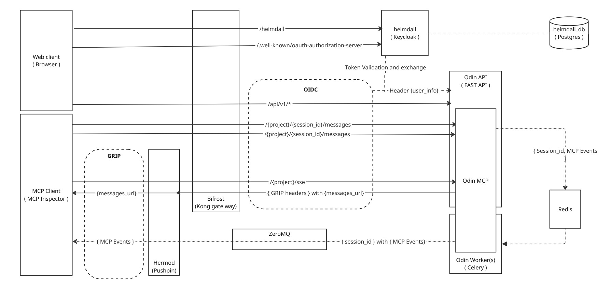
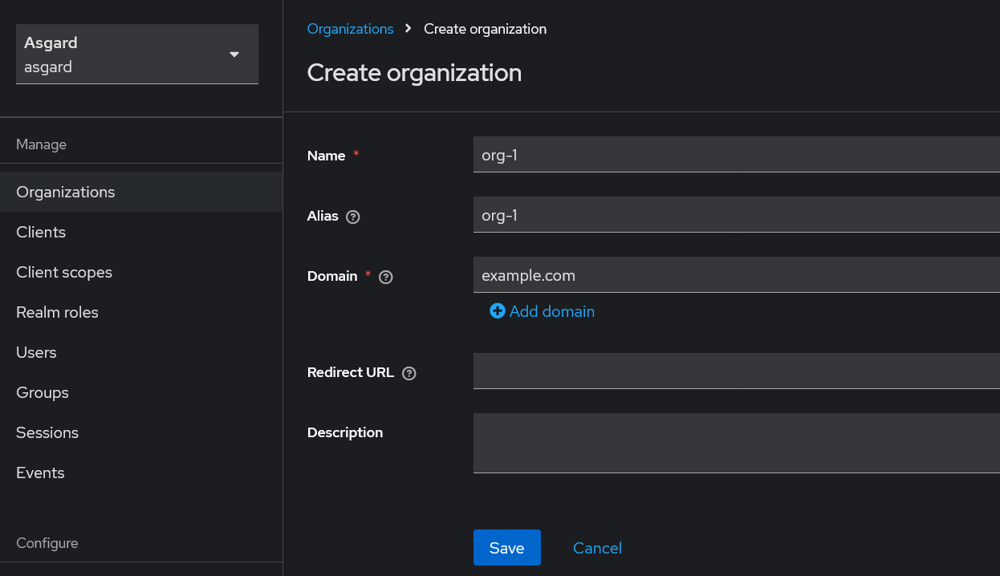
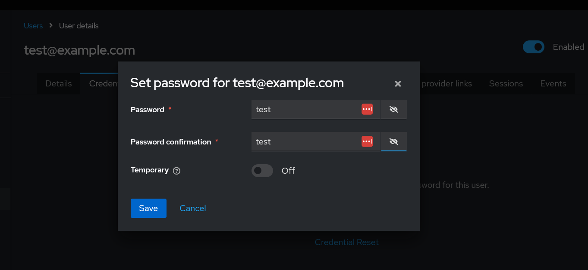
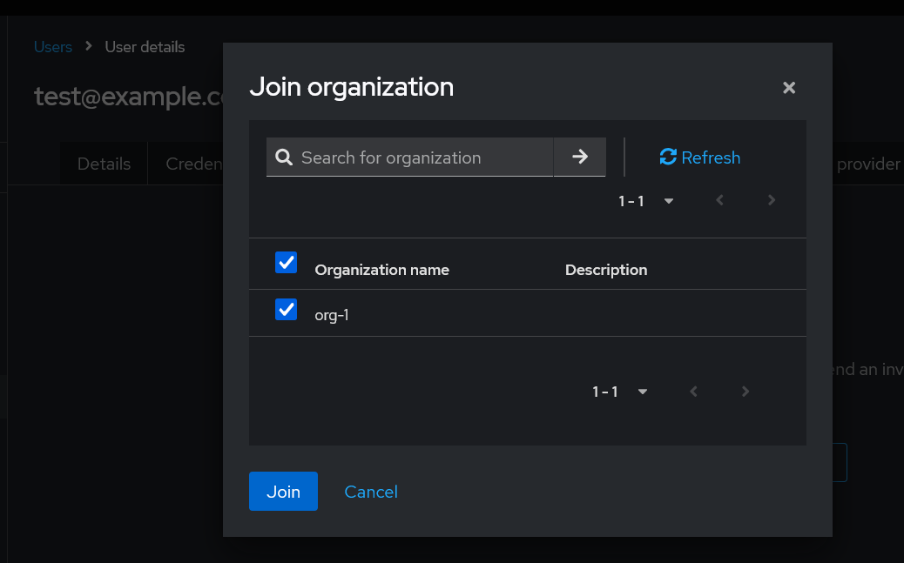
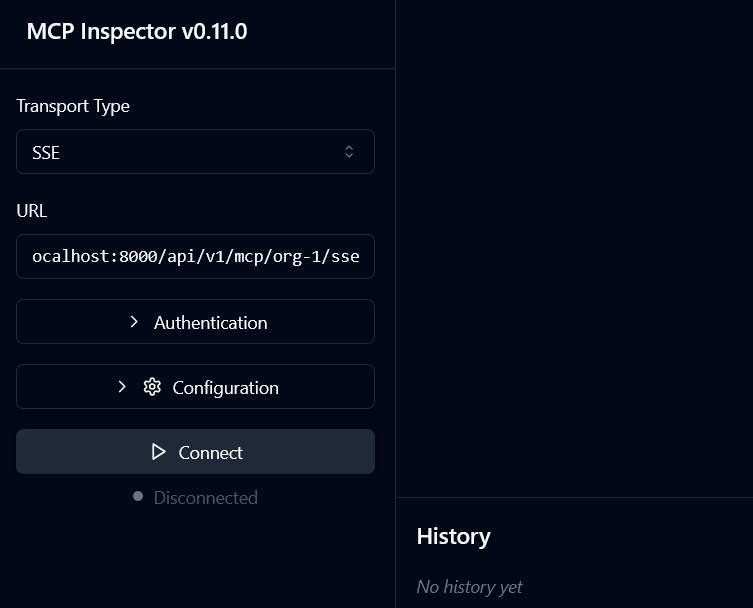
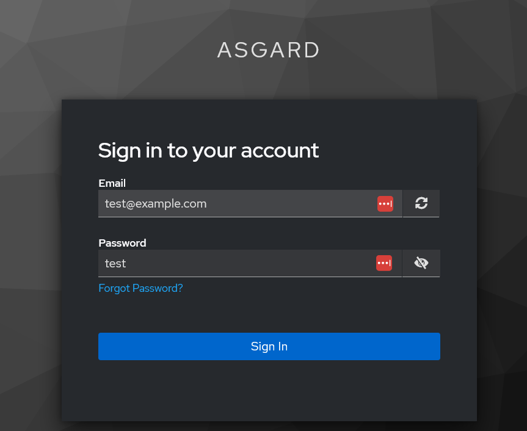
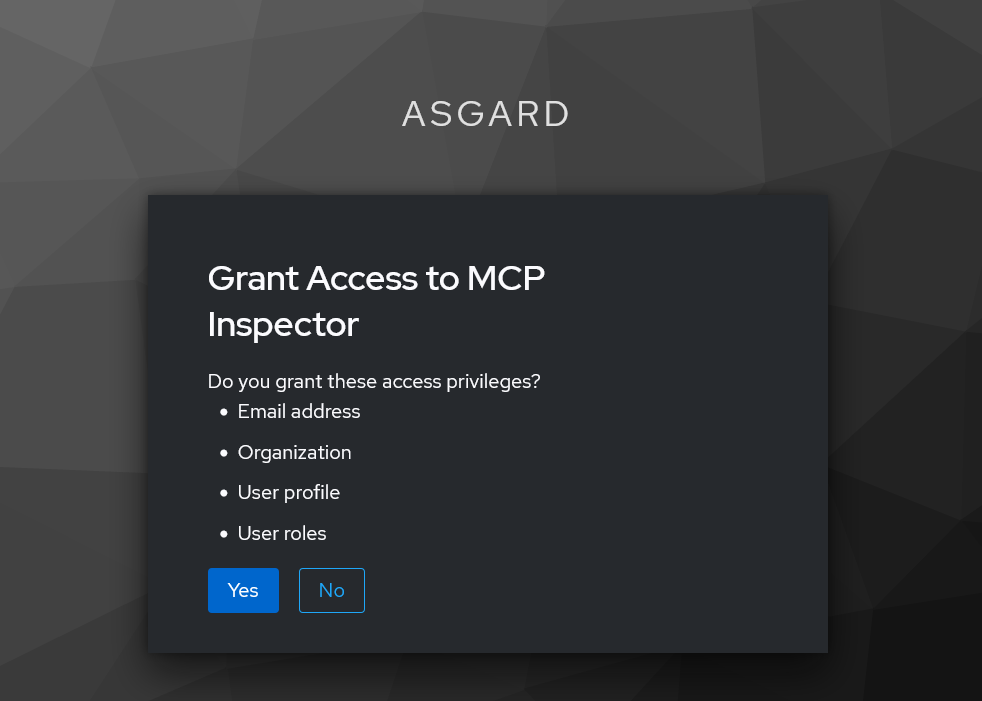
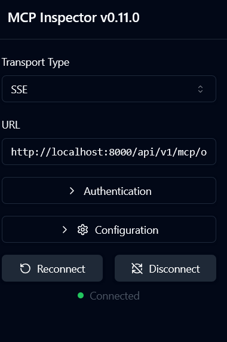

# Outrageously Distributed Infrastructure Network


Asgard is designed as a side project to explore and learn the possibilities of using MCPs in a distributed environment. This project integrates several open source components to provide authentication, API gateway management, efficient streaming, and a standardized way to connect large language models (LLMs) with data sources.


## Table of Contents

- [Overview](#overview)
- [What is MCP?](#what-is-mcp)
- [Problem Statement](#problem-statement)
- [Architecture](#architecture)
  - [Authentication](#authentication)
  - [Streaming and Server-Sent Events (SSE)](#streaming-and-server-sent-events-sse)
- [Services](#services)
  - [Heimdall (Auth Service)](#heimdall-auth-service)
  - [Bifrost (API Gateway)](#bifrost-api-gateway)
  - [Hermod (Streaming Reverse Proxy)](#hermod-streaming-reverse-proxy)
  - [OdinMCP](#odinmcp)
  - [Loki (MCP Inspector)](#loki-mcp-inspector)
- [How It Works](#how-it-works)
- [Getting Started with Asgard](#getting-started-with-asgard)
  1. [Setup Environment](#1-setup-environment)
  2. [Start Services](#2-start-services)
  3. [Configure Keycloak](#3-configure-keycloak)
  4. [Open Loki](#4-open-loki)
  5. [Connect to the OdinMCP Server Using the Inspector](#5-connect-to-the-odinmcp-server-using-the-inspector)
- [Roadmap](#roadmap)
- [Contributing](#contributing)
- [License](#license)
- [Acknowledgements](#acknowledgements)


## Overview

Asgard leverages a microservices-based architecture to ensure scalability, resilience, and performance of [Model Context Protocol](https://github.com/modelcontextprotocol/python-sdk) in distributed deployments. This experimental implementation combines the strengths of popular open source tools to deliver a robust distributed application framework.


## Problem Statement

The goal of Asgard is to address challenges related to:

- Securing user authentication.
- Managing client registration and white labelling domains.
- Handling high-demand streaming.
- Standardizing context communication for LLMs in a distributed ecosystem.


## Architecture

The overall architecture of Asgard is depicted below:



### Key Components

- **Authentication and Authorization:** Managed via [Keycloak](https://www.keycloak.org) with OIDC protocols.
- **API Gateway:** Routes incoming requests to the appropriate service using [Kong Gateway](https://konghq.com) with the [Kong OIDC Plugin](https://github.com/revomatico/kong-oidc).
- **Streaming/SSE:** Handles server-sent events and real-time streaming via [Pushpin](https://pushpin.org) and the [GRIP Protocol](https://pushpin.org/docs/protocols/grip/).


### Authentication

- **Architecture:**  
  Authentication is managed by Keycloak and facilitated by Kong Gateway using OIDC protocols. Each service delegates authentication tasks to specialized systems.

- **Flow:**  
  1. The Bifrost gateway receives a request and extracts the token.
  2. It exchanges the token with the Heimdall service to validate and obtain user details.
  3. Validated user information is cached in memory and shared with downstream services.


### Streaming and Server-Sent Events (SSE)

- **Flow:**  
  1. A request that supports SSE is first directed to Hermod with a header indicating SSE support.
  2. Hermod forwards the request through Bifrost, which routes it to the necessary service/API/MCP.
  3. The server acknowledges the request and responds with a `messages_endpoint` along with GRIP headers, instructing Hermod to hold the connection.
  4. This process offloads the connection management from both the server and Bifrost.
  5. Events can then be published to Hermod either via ZeroMQ or by calling the `/publish` endpoint on Hermod.

- **Solution:**  
  By integrating the GRIP Protocol with Pushpin, Asgard effectively manages real-time communications and minimizes connection overhead on core services.


## Services

### Heimdall (Auth Service)

- **Purpose:**  
  Heimdall, built on top of [Keycloak](https://www.keycloak.org), handles user authentication and authorization. It also manages client registration and white labelling of domains.
  
- **Key Features:**  
  - Secure user authentication and authorization.
  - Integration with Keycloak’s organization management.
  - Centralized client registration.


### Bifrost (API Gateway)

- **Purpose:**  
  Bifrost is the API gateway powered by [Kong Gateway](https://konghq.com). It directs incoming requests to the appropriate services and integrates with Heimdall for token validation.
  
- **Key Features:**  
  - OIDC-based authentication using Kong's OIDC plugin ([Kong OIDC Plugin](https://github.com/revomatico/kong-oidc)).
  - Efficient routing and redirection of API requests.
  - Seamless integration with backend services.


### Hermod (Streaming Reverse Proxy)

- **Purpose:**  
  Hermod serves as a dedicated reverse proxy for handling server-sent events (SSE) and streaming. It leverages [Pushpin](https://pushpin.org) and the [GRIP Protocol](https://pushpin.org/docs/protocols/grip/) to support real-time data streaming.
  
- **Key Features:**  
  - Optimized for streaming and SSE.
  - Offloads streaming responsibilities from the MCP server and Bifrost.
  - Uses [ZeroMQ](https://zeromq.org) for scalable, distributed deployment.


### OdinMCP

**OdinMCP** is the core Model Context Protocol (MCP) controller in Asgard, built with [FastAPI](https://fastapi.tiangolo.com) and the [modelcontextprotocol/python-sdk](https://github.com/modelcontextprotocol/python-sdk). It acts as the control plane for managing context delivery, event streaming, and coordination between microservices and LLMs.

#### Key Responsibilities

- Central hub for context communication between services, LLMs, and clients.
- Provides endpoints for sending, receiving, and streaming context/messages.
- Handles session management, message publication, and event broadcasting.
- Integrates with authentication (Heimdall/Keycloak), API gateway (Bifrost/Kong), and Hermod/Pushpin for SSE streaming.
- Coordinates with Odin Workers (Celery) and Redis for background processing and event queuing.

### Loki (MCP Inspector)

- **Purpose:**  
  Loki hosts the MCP Inspector UI so you can browse and stream events via SSE.

- **Key Features:**  
  - Bundles `@modelcontextprotocol/inspector` as a Docker service  
  - Exposes a web UI on port `6274`  
  - Connects to your org’s SSE endpoint for live event debugging


## How It Works

1. **Authentication:**  
   Requests are routed through Bifrost, which authenticates via Heimdall and passes user info to OdinMCP.
2. **Session Management:**  
   OdinMCP manages per-session context using unique session IDs.
3. **Messaging:**  
   Clients use endpoints like `/api/v1/{org_alias}/{session_id}/messages` and `/api/v1/{org_alias}/sse` to send/receive messages and stream events.
4. **Streaming:**  
   Real-time events are published to Hermod (Pushpin) for efficient SSE delivery.
5. **Workers:**  
   Heavy tasks are processed by Odin Workers (Celery) and results/events are returned via ZeroMQ  to Hermod.


## Getting Started with Asgard

This guide will walk you through setting up and running Asgard on your local machine.


### 1. Setup Environment

Prepare your local environment by running the setup script. This script creates sample configuration and environment files needed for Asgard.

```bash
./setup.sh
```


### 2. Start Services

Launch all required services using Docker Compose:

```bash
docker-compose up
```


### 3. Configure Keycloak

Keycloak is used as the identity provider. Follow these steps to configure it:

#### a. Access the Admin Console

1. Open your browser and navigate to:  
   `http://localhost:8000/heimdall/`
2. Log in with the following admin credentials:
   - **Username:** `admin`
   - **Password:** `adminpassword`

#### b. Verify Pre-Configured Settings

- A sample realm named `asgard` should already exist.
- The necessary sample clients have been pre-configured within the realm.

#### c. Create a New Organization and User

1. **Create Organization:**  
   Within the `asgard` realm, create a new organization. For example, name it `org-1`.

   

2. **Create User:**  
   Create a new user in the realm and assign the user to the newly created organization `org-1`.

   

3. **Set User Credentials:**  
   Ensure the new user sets secure credentials.

   

4. **Assign User to Organization:**  
   Add the user to the `org-1` organization.

   

> **Note:** The initial setup of Heimdall might take some time as it runs initial migrations.


### 4. Open Loki

Loki (the MCP Inspector) is now a service in Docker Compose. After `docker-compose up`, open:

http://localhost:6274/


### 5. Connect to the OdinMCP Server Using the Inspector

Follow these steps to connect to the MCP server for your organization (`org-1`):

1. Open Loki in your browser: `http://localhost:6274/`

2. Change the transport type to **SSE** and enter the following URL:

   ```
   http://localhost:8000/api/v1/mcp/org-1/sse
   ```

   This URL connects to the `org-1` organization's MCP endpoint and starts streaming events. Make sure to use the correct organization alias.


**Note:** If you get an error like below in uyour docker logs for Heimdall:
```
heimdall       | 2025-05-10 15:23:17,664 WARN  [org.keycloak.events] (executor-thread-1) type="CLIENT_REGISTER_ERROR", realmId="7a1303f6-e6b0-482c-8135-0efe346054df", realmName="asgard", clientId="null", userId="null", ipAddress="127.0.0.1", error="not_allowed", client_registration_policy="Trusted Hosts"
```

Add the I.P address of the client( In the error ) to the `trusted_hosts` list in the Keycloak realm settings. This allows the client to register and connect successfully.

#### Connection Steps

- **Enter SSE Endpoint:**  
  

- **Login Prompt:**  
  

- **Grant Access to MCP Client:**  
  

- **Successful Connection:**  
  


## Roadmap

Future enhancements for Asgard include:

- **Authentication Enhancements:**  
  - ~~Setup heimdall/keycloak with seed config.~~
  - ~~Setup interface between Heimdall and OdinMCP using OIDC.~~
  - Setup mcp inspector in docker-compose.

- **Streaming Improvements:**  
  - Setup hermod/pushpin with GRIP protocol.
  - Setup hermod/pushpin with ZeroMQ.
  - Setup interface between hermod and OdinMCP using GRIP protocol.
  - Setup interface between hermod and OdinMCP using ZeroMQ.

- **Build UI for Asgard:**  
  - Build a simple UI for Asgard to manage organizations, users, and sessions.
  
- **OdinMCP Python Library:**  
  Refactoring OdinMCP into its own client library to better abstract MCP complexities and simplify integrations.


## Contributing

Contributions to Asgard are welcome! Please open issues, fork the repository, and submit pull requests to help improve functionality and performance.

#### Developer Notes
- Current implementation is a reference and will be refactored into a standalone library.
- Strictly follows MCP spec for interoperability.
- Contributions for new messaging patterns and features are welcome!


## License

This project is licensed under the MIT License. See the [LICENSE](./LICENSE) file for details.


## Acknowledgements

- [Keycloak](https://www.keycloak.org)
- [Kong Gateway](https://konghq.com)
- [Kong OIDC Plugin](https://github.com/revomatico/kong-oidc)
- [Pushpin](https://pushpin.org)
- [GRIP Protocol Documentation](https://pushpin.org/docs/protocols/grip/)
- [ZeroMQ](https://zeromq.org)
- [Model Context Protocol](https://github.com/modelcontextprotocol/python-sdk)
- [FastAPI](https://fastapi.tiangolo.com)

Happy coding and exploring the distributed environment with Asgard!