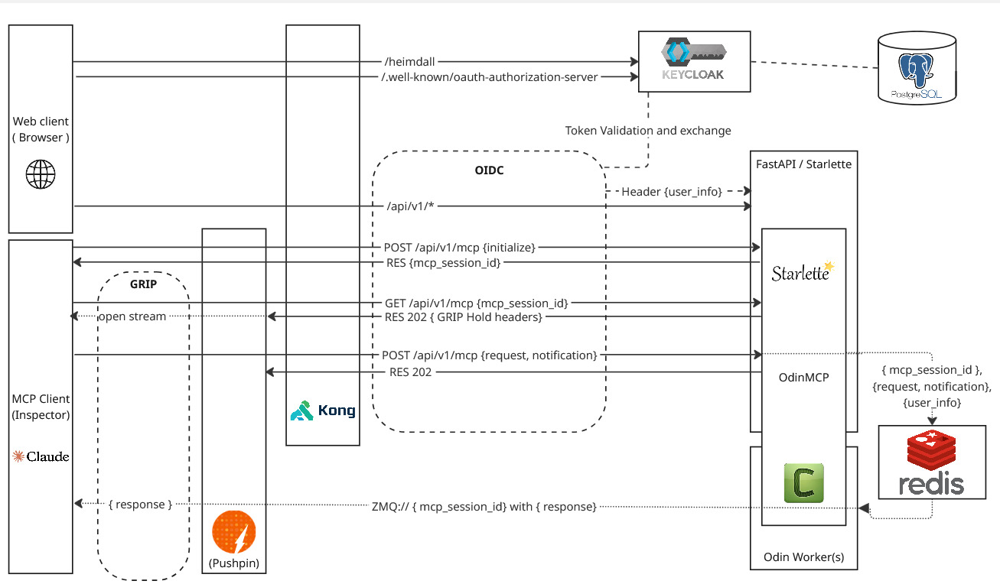

# OdinMCP

<div align="center">
<h3><strong>O</strong>utrageously <strong>D</strong>istributed <strong>I</strong>nfrastructure <strong>N</strong>etwork for MCP servers.</h3>


[![PyPI][pypi-badge]][pypi-url]
[![MIT licensed][mit-badge]][mit-url]
[![Python Version][python-badge]][python-url]

</div>

## Table of Contents

- [Overview](#overview)
- [Problem Statement](#problem-statement)
- [Architecture](#architecture)
- [Installation](#installation)
- [Quickstart](#quickstart)
  - [How to Deploy](#how-to-deploy)
    - [Project Setup](#1-project-setuponly-once)
    - [Start Asgard Proxies and Services](#2-start-asgard-proxies-and-services)
    - [Start the Web Server](#3-start-the-web-server--in-a-new-terminal-)
    - [Start the Worker Process](#4-start-the-worker-process--in-a-new-terminal-)
- [Migrating from mcp.FastMCP to OdinMCP](#migrating-from-mcpfastmcp-to-odinmcp)
- [Deployment](#deployment)
  - [Deploying Asgard with Docker Compose](#deploying-asgard-with-docker-compose)
  - [Web Server](#web-server)
  - [Worker Process](#worker-process)
- [Contributing](#contributing)
- [License](#license)


## Overview


OdinMCP extends the base MCP library by adding support for distributed workers, enabling scalable task execution across multiple nodes. This is accomplished while fully supporting the [streamable-http transport](https://modelcontextprotocol.io/specification/2025-03-26/basic/transports#streamable-http) as suggested in the MCP specification, allowing for efficient real-time streaming and interoperability.


## Problem Statement

The goal of OdinMCP is to address challenges related to:

- Securing user authentication.
- Handling high-demand streaming.
- Distributing tasks across multiple nodes for scalability.

## Architecture

OdinMCP is designed to operate as a distributed system, enabling secure, scalable, and efficient management of large language models (LLMs) and their connections to diverse data sources. The architecture brings together several critical capabilities: authentication, API gateway management, real-time streaming, and a unified inspector UI for testing and event streaming.



At the core of this distributed architecture is **Asgard**, which provides the infrastructure layer that integrates and orchestrates these capabilities. Asgard leverages several open source components to deliver a robust and modular platform:

- **Authentication & Authorization:** Managed via [Keycloak](https://www.keycloak.org) and OIDC protocols, with Heimdall handling user authentication and authorization.
- **API Gateway:** Bifrost, powered by [Kong Gateway](https://konghq.com), routes and secures incoming requests, integrating with Heimdall for token validation.
- **Streaming & Server-Sent Events (SSE):** Hermod, leveraging [Pushpin](https://pushpin.org) and the [GRIP protocol](https://pushpin.org/docs/protocols/grip/), manages real-time streaming and offloads connection management from core services.
- **Inspector UI:** Loki provides a web interface for browsing and streaming events via [Inspector](https://github.com/modelcontextprotocol/inspector) and SSE.

By combining these components under the Asgard infrastructure, OdinMCP achieves a standardized and extensible approach to running MCP-based systems in distributed environments.

For more details, see the [Asgard documentation](./asgard/README.md).

## Installation

You can install OdinMCP using pip or poetry:

```bash
pip install odinmcp
```

or

```bash
poetry add odinmcp
```


## Quickstart


Below is a minimal example of a `server.py` you can use to get started with OdinMCP. This file defines a few example tools and sets up both the web server and worker:

```python
from odinmcp import OdinMCP
from mcp.server.fastmcp import Context
import time
from typing import Any

mcp = OdinMCP("Odin MCP Demo")

@mcp.tool()
def add(a: int, b: int) -> int:
    return a + b

@mcp.tool()
async def send_client_request_for_roots(ctx: Context) -> list[Any]:
    return await ctx.session.list_roots()

@mcp.tool()
async def very_long_running_task_will_cancel(ctx: Context) -> None:
    print("very_long_running_task_will_cancel has started")
    time.sleep(30)
    print("very_long_running_task_will_cancel has finished")

web, worker = mcp.sse_app()
```

You can now run this file using the CLI commands below.

### How to Deploy

1. **Project Setup**(only once)
   ```bash
   odinmcp setup_asgard
   ```
   Copies the default Asgard project structure into your current directory. Add `--force` to overwrite existing files.

2. **Start Asgard Proxies and Services**
   ```bash
   cd ./asgard
   docker-compose up
   ```
   This will run all the required proxies and services for Asgard using Docker Compose.

3. **Start the Web Server** ( in a new terminal )
   ```bash
   odinmcp web server:app --host 0.0.0.0 --port 80
   ```
   Launches the Starlette ASGI web server. Replace `server:app` with your module and app variable (e.g., `myproject.main:web`).

4. **Start the Worker Process** ( in a new terminal )
   ```bash
   odinmcp worker server:worker --loglevel=info
   ```
   Starts the Celery worker for distributed task processing. Replace `server:worker` with your module and worker variable. You can run any number of workers for distributed task processing.


> **Note:**
> - The web server and worker process must be started separately for full functionality.
> - You can use the standard Uvicorn and Celery CLIs if you prefer, but the OdinMCP CLI provides a unified interface.


## Migrating from mcp.FastMCP to OdinMCP

OdinMCP is a drop-in replacement for FastMCP with improved scalability and streaming. To migrate:

- **Uninstall mcp:** `pip uninstall mcp`
- **Install OdinMCP:** `pip install odinmcp`
- **Update Imports:** Replace `from mcp.server.fastmcp import FastMCP` with `from odinmcp import OdinWeb` (or `OdinMCP` as appropriate)
- **Replace Class Names:** Change `FastMCP` to `OdinWeb` (or `OdinMCP`)
- **App Creation:** Use `app, worker = mcp.sse_app()` instead of `app = mcp.streamable_http_app()`

### Deployment

#### Deploying Asgard with Docker Compose
To start all Asgard infrastructure services (API gateway, authentication, streaming, etc.), use Docker Compose:

```bash
cd ./asgard
docker-compose up
```
This will launch all required proxies and services for distributed operation. Make sure you have run `odinmcp setup_asgard` first to generate the Asgard directory structure.

#### Web Server
- **FastMCP:**
  - `uvicorn server:app --host 0.0.0.0 --port 80`
  - or `mcp dev server.py`
- **OdinMCP:**
  - `odinmcp web server:app --host 0.0.0.0 --port 80`
  - or use any ASGI server (e.g., Uvicorn) as above

#### Worker Process
- **FastMCP:**
  - No explicit background worker; FastMCP does not support distributed background processing.
- **OdinMCP:**
  - `odinmcp worker server:worker --loglevel=info`
  - or `celery -A server worker --loglevel=info`
  - The worker must be started separately for distributed task processing.

**Note:** For OdinMCP, both the web server and worker process must be started for full functionality.


## Contributing

Contributions to OdinMCP are welcome! Please open issues, fork the repository, and submit pull requests to help improve functionality and performance.


## License

This project is licensed under the MIT License. See the [LICENSE](./LICENSE) file for details.


<!-- Badge definitions -->
[pypi-badge]: https://img.shields.io/pypi/v/odinmcp.svg?style=flat-square
[pypi-url]: https://pypi.org/project/odinmcp/
[mit-badge]: https://img.shields.io/badge/license-MIT-blue.svg?style=flat-square
[mit-url]: https://opensource.org/licenses/MIT
[python-badge]: https://img.shields.io/pypi/pyversions/odinmcp.svg?style=flat-square
[python-url]: https://www.python.org/downloads/

